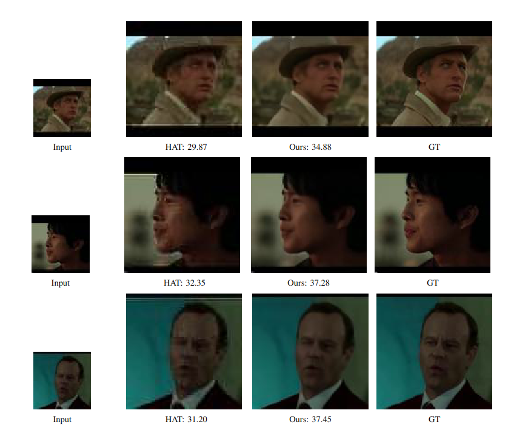

# Efficient Video Super-Resolution via Two-Step 2D SR and Image-to-Image Conditional Generation
This is the official implementation of the paper "Efficient Video Super-Resolution via Two-Step 2D
SR and Image-to-Image Conditional Generation"

## Proposed Method



## Abstract
Abstract—Video super-resolution (VSR) has gained significant
attention due to its potential to enhance video quality. However,
existing VSR models are often computationally heavy, limiting
their practical application. To address this, we propose a two-
step approach: applying 2D super-resolution (SR) followed by
image-to-image conditional generation. Initial experiments using
Mean Squared Error (MSE) show significant improvements.
Replacing MSE with Mean Absolute Error (MAE) and blending
it with Structural Similarity Index Measure (SSIM) further
enhances performance. Our method achieves superior results
with reduced computational complexity, offering a practical
solution for real-world VSR applications.

## Result


## Environment Installation
```
conda env create -n "ENVIRONMENT NAME" -f env.yml
conda activate "ENVIRONMENT NAME"
```

## Dataset Preperation

To prepare the dataset for training or evaluation, you need to extract the necessary image paths using the `fetch_imgpath` function provided in `fetch_data.py`. This function reads metadata from a CSV file and organizes image paths into tuples for efficient processing.

### `fetch_imgpath` Function Overview

The `fetch_imgpath` function takes the following arguments:
- `csv_path`: Path to the CSV file containing metadata with a `directory_name` column.
- `raw_images_64_path`: Path to the directory containing 64x64 raw images.
- `raw_images_128_path`: Path to the directory containing 128x128 ground truth images.
- `hat_path`: Path to the directory containing HAT-processed images.

The function returns a list of tuples, each containing four image paths:
1. HAT-processed input image
2. Left neighbor input image (64x64)
3. Right neighbor input image (64x64)
4. Ground truth image (128x128)

### Example Usage

To use the function:

```python
from fetch_data import fetch_imgpath

# Example paths
csv_path = "metadata.csv"
raw_images_64_path = "./data/64x64/"
raw_images_128_path = "./data/128x128/"
hat_path = "./data/HAT/"

image_paths = fetch_imgpath(csv_path, raw_images_64_path, raw_images_128_path, hat_path)
print(image_paths[:5])  # Display the first 5 image path tuples
```

## Training
```
python train.py
```
## Inference
```
python test.py
```

## References
- https://github.com/XPixelGroup/HAT